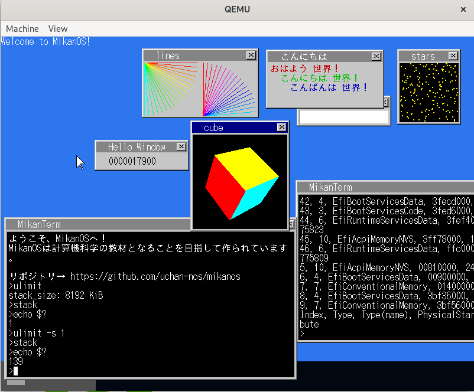

# 30日目

<!-- mtoc-start -->

- [1. アプリにパスを通す](#1-アプリにパスを通す)
- [2. more コマンド](#2-more-コマンド)
- [3. cat を入力に対応させる](#3-cat-を入力に対応させる)
- [4. 閉じるボタン](#4-閉じるボタン)
- [5. テキストビューアー](#5-テキストビューアー)
- [6. 画像ビューアー](#6-画像ビューアー)

<!-- mtoc-end -->

## 1. アプリにパスを通す

といっても決め打ちで `/apps` 内のファイルを探すようにするだけ。

## 2. more コマンド

grep 以外のコマンドは一応全部実装してきたけどもういいか。
OS 事態には関係ないし。

ただ、これの途中でパイプを使った場合は、パイプの右側にイベントを送るようにするという変更があったので、
それはやった。
このテストは `echo | cube` とかで Ctrl+Q で閉じれることで確認した。
（正確には今までは cube で開いたウィンドウに対して Ctrl+Q をしたときのみ閉じられて、
ターミナルで Ctrl+Q をしても閉じられなかったのが、閉じられるようになっていたのでOK）

## 3. cat を入力に対応させる

やった。

## 4. 閉じるボタン

実装した。
アプリがイベントを待ち受けている間はイベントは全てアプリに送られるので、
ターミナルの閉じるボタンを押してもアプリのウィンドウが閉じるか、なにも反応がないが、
これはもう元々の設計の問題なのでこのままで。

## 5. テキストビューアー
## 6. 画像ビューアー

ここらへんはまあただのアプリで OS 事態に関係あるわけじゃないし、
特に OS の機能拡充、テストにも関係ないしパスでいいか。

ということで終了！

